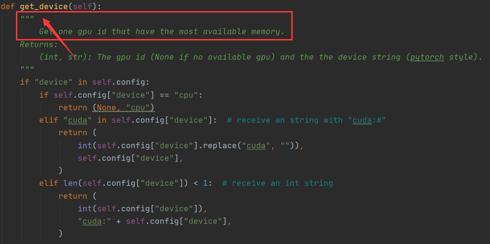
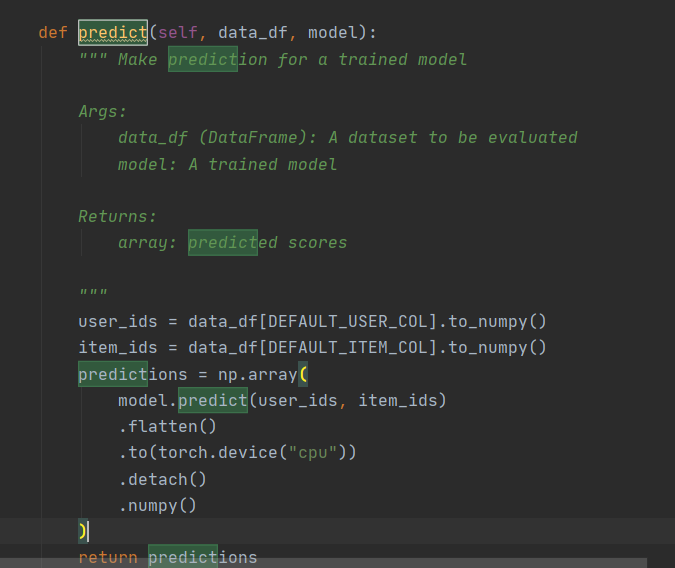
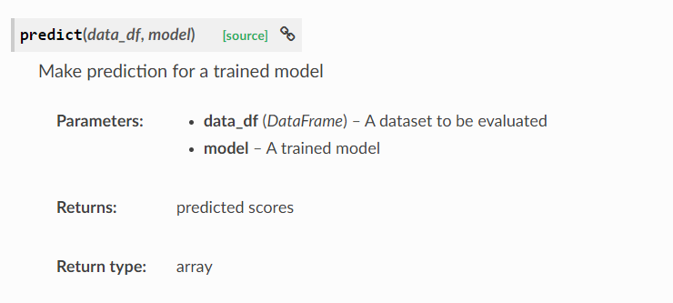
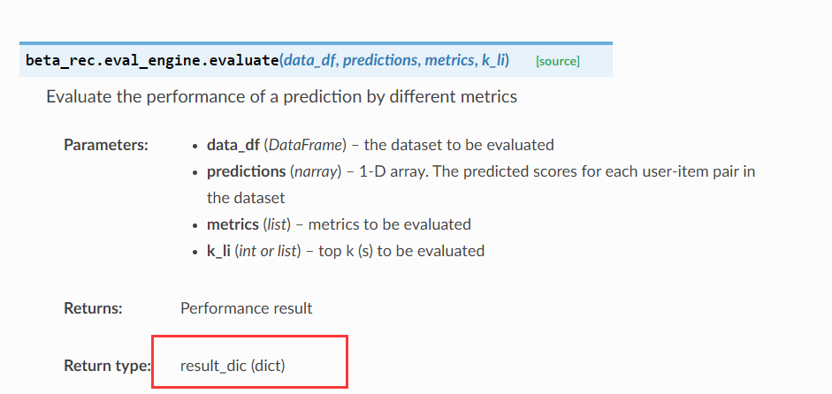
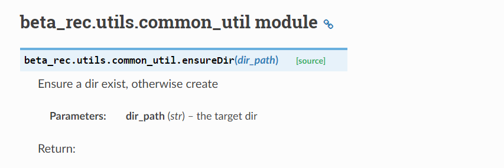
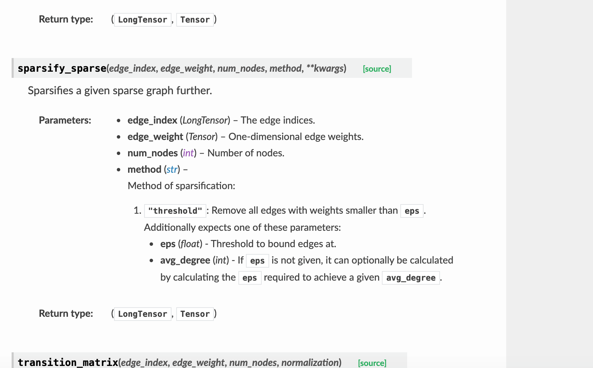
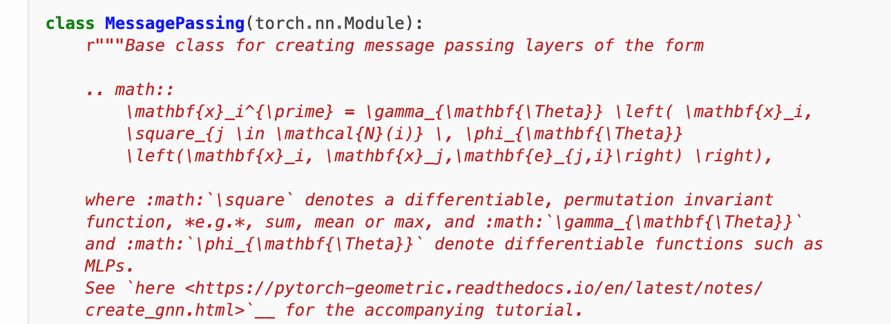
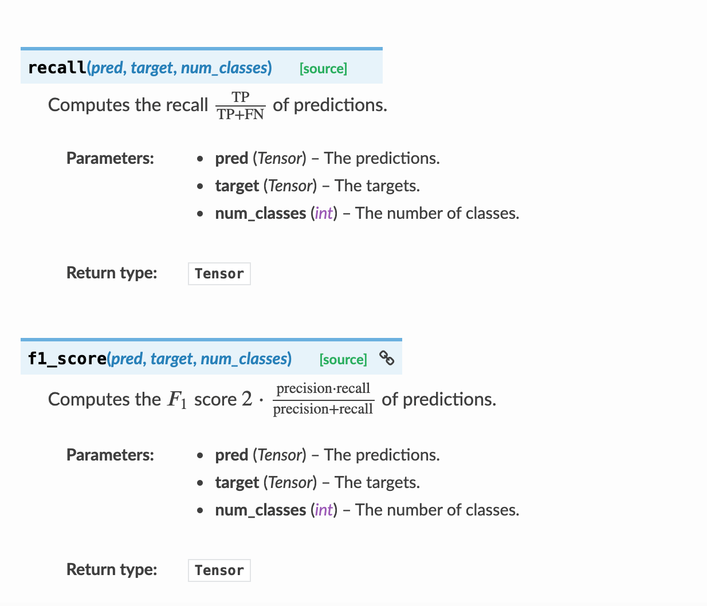

# Documentation for Code Format Standard 代码格式规范

**Author:** Junhua Liang, Yucheng Liang

**Last Updated:** 2020-06-10

## Goal

As we expect to become a efficient and useful generalized framework regarding recommendation system for a wide range of researchers, our code readability is extremly critical. We hope building a powerful framework with concise codes, which allows others to understand our code in an easy way even contribute to our project.

In addition, we try to maintain an informative documentation, which requires a formatted comment style in codes. Stacking everything into a documentation is quite easy, but a clear, formatted documentation will be more helpful, and that's what we want to achieve.

Consequently, in this documentation, some rules are listed in order to keep developers writting codes properly. And we hope every contributor is supposed to observe these standards.

## Details

## Special Cases

## 1. Indention 缩进问题

There should be **no space** between the first letter and the `"""` in the first line of comment. And the first character should **use uppercase**.

注释应该要顶着`"""`来写。同时首字母需要大写。

| 代码编写格式                                                 | 文档显示                                                     |
| ------------------------------------------------------------ | ------------------------------------------------------------ |
|  |  |
|  |  |

## 2. 注释规范

正确例子：

| 代码编写                                                     | 显示                                                         |
| ------------------------------------------------------------ | ------------------------------------------------------------ |
|  |  |

错误例子：

| 代码编写                                                     | 显示                                                         |
| ------------------------------------------------------------ | ------------------------------------------------------------ |
|  |  |

## 3. 注释换行问题

| 代码编写                                                     | 显示                                                         |
| ------------------------------------------------------------ | ------------------------------------------------------------ |
|  |  |

## 4. 小问题

| 代码                                                         | 显示                                                         |
| ------------------------------------------------------------ | ------------------------------------------------------------ |
|  |  |

## 5. 跳转到某个类的注释写法

Return type的指定:

## 6. 添加数学公式的方法

## 7. 添加例子说明

| 代码                                                         | 显示结果                                                     |
| ------------------------------------------------------------ | ------------------------------------------------------------ |
|  |  |

## 8. 建议

