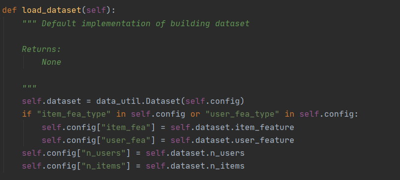

# Documentation for Code Format Standard 代码格式规范

**Author:** Junhua Liang, Yucheng Liang

**Last Updated:** 2020-06-14

## Goal

As we expect to become a efficient and useful generalized framework regarding recommendation system for a wide range of researchers, our code readability is extremly critical. We hope building a powerful framework with concise codes, which allows others to understand our code in an easy way even contribute to our project.

In addition, we try to maintain an informative documentation, which requires a formatted comment style in codes. Stacking everything into a documentation is quite easy, but a clear, formatted documentation will be more helpful, and that's what we want to achieve.

Consequently, in this documentation, some rules are listed in order to keep developers writting codes properly. And we hope every contributor is supposed to observe these standards.

------

## Overview

In general, all our codes follow the [Google Python Style Guide](http://google.github.io/styleguide/pyguide.html), and we use PEP8 to check all the code which is ready to merge into master in Github Action. Your pull request will not be approved before all your codes are formatted according to the guide.

The following examples are part of `demo.py`. For complete usages, please refer to `demo.py`.

### Class

This is an example of how to write comments of a class.

```python
r"""This document is a demo."""


class NoteDemo(object):
    r"""A class used to sort an unsorted array with different kind of algorithm.

    Including quick-sort, merge-sort, shell-sort, etc. Please refer to :class:`NoteDemo`

    for more details.

    .. note::
        If you want to let user switch to specific class, please add :class:`class-name`

    .. math::
        a^{2} + b^{2} = c{^2}

    If you want to use unordered list, try as follows:

    * :attr:`a`: first params.
    * :attr:`b`: second params.

    Class information...
 
    Class information...

    Attributes:
        init_array: unsorted array, :math:`\sum_{i=0}^{n}a_i` is inline math example.
    """

    def __init__(self, init_array):
        r"""Init the demo class."""
        self.array = init_array
```

- **Introduction** and **Summary**: The first line of comments should be introduction, which is ended with a period. And after a new line, you should write the details of this class, which is also ended with a period.
- **Note block**: If you want to note something or write some warnings, you should use the block.
- **Attributes**: All the class variables should be written here. So there is no need for you to write the arguments of `init` methods.

### Method

```python
def return_function(self, param1, param2):
        r"""Show how to write notes correctly.

        I will show math, example, yield in this function.
        
        Please follow this standard to write your code.

        .. note::
            If you want to write some note, please add `Note:`
            as this example.

        Example:

            >>> demo = NoteDemo([1, 2, 3, 4])
            ... demo.return_function("Hello", true)

        Args:
            param1 (str): string type parameter example.
            param2 (bool): bool type parameter example.

        Returns:
            bool: True if yes, False if no.

        Raises:
            ValueError: param1 is not a string
        """
        pass
```

- **Introduction** and **Summary**: The first line of comments should be introduction, which is ended with a period. And after a new line, you should write the details of this method, which is also ended with a period.
- **Args**: You should detail each parameter here, writing their names, types and meaning.
- **Returns**: You should detail each return values here, writing their types and meaning. For more than one return value, please refer to next part.
- **Raise**: If this method raise any exception, you should write them in this part.

```python
def yield_function(self, param1, param2):
        r"""Show how to write notes when you are ready to write a function with yield.

        Please follow these standard to finish your code.

        Args:
            param1 (int): int type parameter
            param2 (list): list tpye parameter
            
		Returns:
            (bool, int): a bool and an int.
            
        Yields:
            (string, torch.Tensor): Tuple containing a string type and a tensor type.
        """
        pass
```

**Returns**: If the method returns more than one value, you should first write their types in a bracket, and then detail them.

**Yields**: Returns some iterators, you should write in this part.

### Example Block

```python
Example:
	>>> demo = NoteDemo([1, 2, 3, 4])
	... demo.return_function("Hello", true)
```

- If you want to give some example of how to use this method, this is a way for you to share.

### Math Block

```python
.. math::
	a^{2} + b^{2} = c{^2}
```

- If the method have some mathematical background, you can use math block to provide some information.

### Jump to a class definition

If you want to link a class to its definition in comments, you can write comments as the following:


### Return Type

There are many ways to write returns. Just choose one of them and clarify the values and types.


------

## Format Check

As we want to provide a good documentation, we hope use some tools to maintain our quality of comments. In general, we use [pydocstyle](https://github.com/PyCQA/pydocstyle) to check our code in CI. If your code fail to meet the requirements of such a check, your PR will not be approved.

## Special Cases

In this part, we try to collect 

### 1. Indention 缩进问题

There should be **no space** between the first letter and the `"""` in the first line of comment. And the first character should **use uppercase**.

注释应该要顶着`"""`来写。同时首字母需要大写。

| Code Example                          | Documentation                         |
| ------------------------------------- | ------------------------------------- |
|  |  |
|  |  |

### 2. Newline 换行问题

There should be a new line between summary and details in a comment block. But in the detail part, there should be no new line.

| Code Example                          | Documentation                          |
| ------------------------------------- | -------------------------------------- |
|  |  |

------

## Action Item

- [ ] Correct all typos in code, including code and comments.
- [ ] Correct all naming that do not match the naming rules.
- [ ] Format all comments, adding usage example, more informative description etc.
